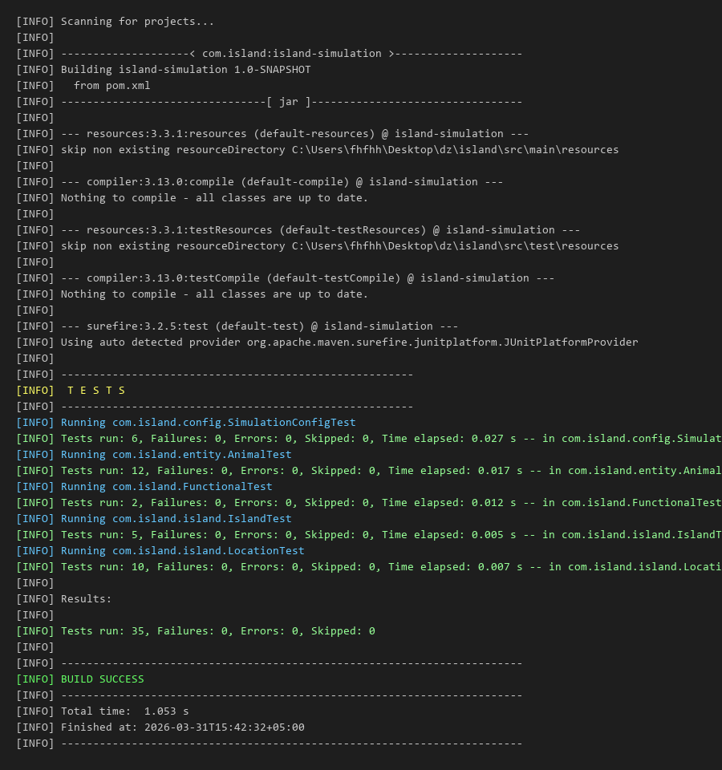

# Island Simulation - Тестирование

Проект моделирует экосистему острова, на котором живут хищники, травоядные и растения. Животные питаются, размножаются, перемещаются и голодают в многопоточной среде.

## Структура проекта

```
src/
├── main/java/com/island/
│   ├── Main.java
│   ├── config/SimulationConfig.java
│   ├── entity/
│   │   ├── Animal.java
│   │   ├── Herbivore.java
│   │   ├── Predator.java
│   │   ├── Plant.java
│   │   ├── herbivores/ (10 видов)
│   │   └── predators/ (5 видов)
│   ├── island/
│   │   ├── Island.java
│   │   └── Location.java
│   ├── simulation/SimulationEngine.java
│   └── statistics/StatisticsCollector.java
│
└── test/java/com/island/
    ├── config/SimulationConfigTest.java
    ├── entity/AnimalTest.java
    ├── island/
    │   ├── IslandTest.java
    │   └── LocationTest.java
    └── FunctionalTest.java
```

## Запуск тестов

```
mvn test
```

## Результаты тестирования

Всего тестов: **35** (33 юнит + 2 функциональных), все проходят.

| Тестовый класс | Кол-во тестов | Статус |
|---|---|---|
| SimulationConfigTest | 6 | OK |
| AnimalTest | 12 | OK |
| LocationTest | 10 | OK |
| IslandTest | 5 | OK |
| FunctionalTest | 2 | OK |

### Юнит-тесты

**SimulationConfigTest** - проверка конфигурации и таблиц вероятностей:
- параметры животных (вес, скорость, макс. на клетку, потребность в еде)
- вероятности поедания (волк-кролик, медведь-удав и т.д.)
- поведение при запросе неизвестного вида

**AnimalTest** - проверка базовой логики животных:
- создание волка с правильными параметрами из конфига
- начальная сытость = 50% от потребности
- установка позиции на острове
- голодание уменьшает сытость
- голодание убивает при отрицательной сытости
- эмодзи у разных видов
- травоядное ест растения, не ест при полной сытости
- размножение требует пару, при наличии пары создает потомство
- гусеница имеет скорость 0

**LocationTest** - проверка ячейки острова:
- координаты
- добавление/удаление животных
- подсчет по типу
- рост растений, ограничение максимумом
- удаление растений, защита от отрицательных значений
- удаление мертвых животных
- неизменяемость списка getAnimals()

**IslandTest** - проверка острова:
- размеры
- создание всех ячеек
- получение ячейки по координатам
- заселение растениями и животными

### Функциональные тесты

**testFullLifecycle** - полный цикл жизни экосистемы: создание острова, заселение, один полный такт (питание -> размножение -> перемещение -> голодание -> очистка мертвых), проверка что популяция выжила.

**testPredatorPreyEcosystem** - взаимодействие хищник-жертва: волк в клетке с 10 кроликами, проверка что волк охотится и выживает, а часть кроликов погибает.

### Используемые техники тестирования

- **Эквивалентное разбиение**: проверка параметров для разных категорий (хищник/травоядное/всеядное)
- **Граничные значения**: рост растений до максимума, удаление при 0, голодание до смерти
- **Таблица решений**: таблица вероятностей поедания (известные/неизвестные пары)
- **Негативное тестирование**: неизвестный вид, размножение без пары, еда при полной сытости

### Скриншот прохождения тестов


